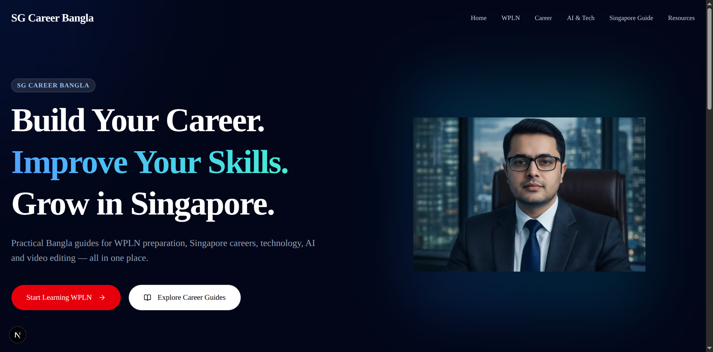
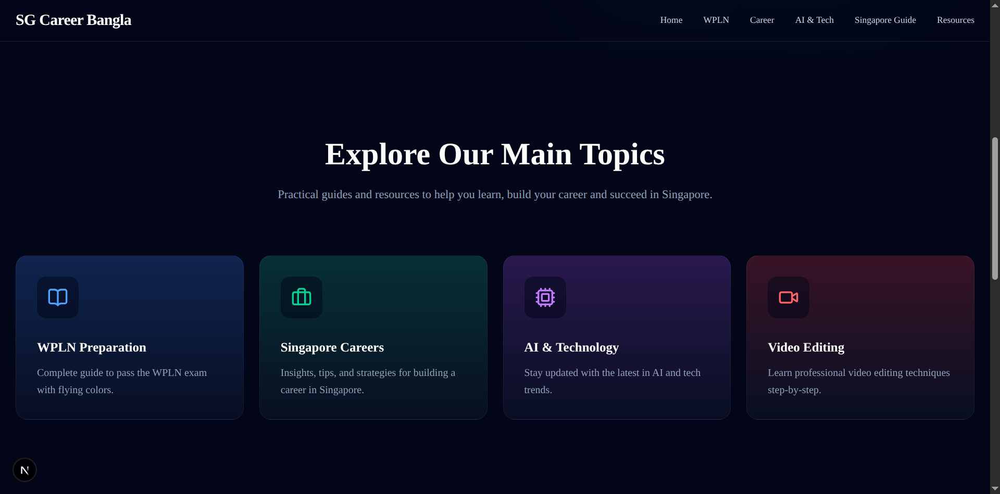
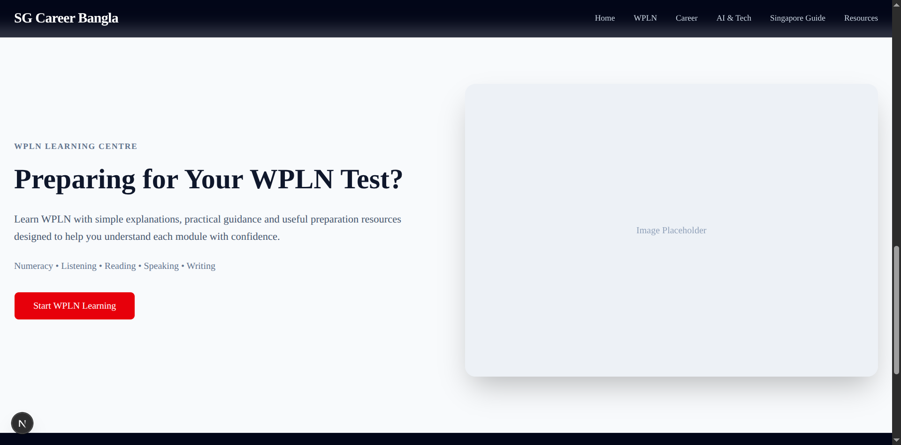
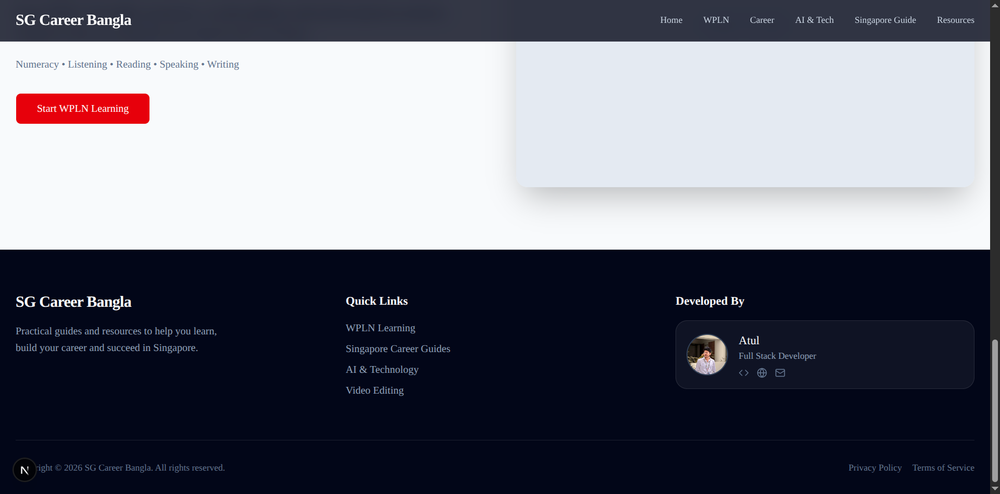

# SG Career Bangla

A premium, high-performance web application designed for **SG Career Bangla**, featuring buttery-smooth scrolling, modern glassmorphism UI, and beautiful micro-interactions.

This project was built to migrate the original WordPress site to a cutting-edge modern React stack.

## ✨ Features

- **Premium UI/UX:** A stunning aesthetic utilizing sleek dark modes, subtle radial gradients, and modern typography.
- **Smooth Scrolling:** Powered by [Lenis](https://lenis.studiofreight.com/) for a native, frictionless scrolling experience.
- **Scroll-Driven Animations:** Elements elegantly reveal, slide, and stagger as you navigate down the page, powered by [Framer Motion](https://www.framer.com/motion/).
- **Accessible Components:** Built on top of [shadcn/ui](https://ui.shadcn.com/) for robust, accessible, and highly customizable UI elements.
- **Next.js App Router:** Leverages the latest React paradigms for optimal SEO, fast page loads, and static site generation.

## 🛠 Tech Stack

- **Framework:** Next.js (App Router)
- **Styling:** Tailwind CSS + shadcn/ui
- **Animations:** Framer Motion
- **Scrolling:** Lenis
- **Icons:** Lucide React

## 📸 Screenshots

Here are some glimpses of the newly designed application:

### Home & Hero Section


### Topics Section (with Hover & Scroll Effects)


### WPLN Learning Centre


### Professional Footer (with Developer Box)


## 🚀 Getting Started

First, install the dependencies:

```bash
npm install
```

Then, run the development server:

```bash
npm run dev
```

Open [http://localhost:3000](http://localhost:3000) with your browser to see the result. You can start editing the page by modifying `src/app/page.tsx`. The page auto-updates as you edit the file.

## 🔒 Security
Sensitive files (like environment variables and secrets) are automatically ignored via `.gitignore` to prevent accidental commits of private data.

## 📜 License
Copyright © 2026 SG Career Bangla. All rights reserved.
